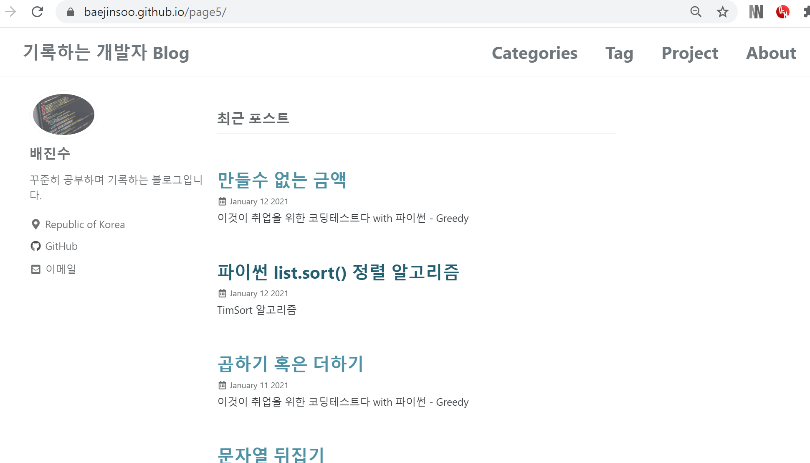

## 공부하는 내용과 삽질하는 내용을 기록하는 개인 DEV Blog

https://baejinsoo.github.io/

개발자는 끈임없이 배워야 하기 때문에,  배운 내용들이나 프로젝트를 하면서 삽질? 했던 일들을 기억하고 다른 사람들에게도 공유하기위해 만든 개인 블로그 사이트 입니다.

구글링하면서 많은 개발 블로그들을 보았고, 거기에서 많은 도움을 받았던 기억이 많습니다. 그동안은 나도 언젠가 꼭 저렇게 될 거야.. 만 생각했지만 남들한테 부끄러운 내용이라도 지금부터라도 해보자는 마음으로 만들게 되었습니다.

# [Minimal Mistakes Jekyll theme](https://mmistakes.github.io/minimal-mistakes/)

Minimal Mistakes is a flexible two-column Jekyll theme, perfect for building personal sites, blogs, and portfolios. As the name implies, styling is purposely minimalistic to be enhanced and customized by you :smile:.