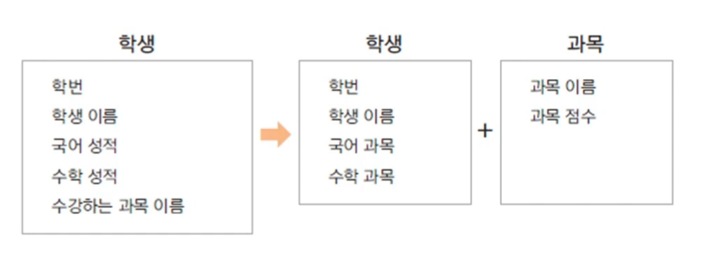

## 생성자

##### 생성자 (constructor)

- 객체를 생성할 때 new 키워드와 함께 호출 (객체 생성 외에는 호출할 수 없음)
- 인스턴스를 초기화 하는 코드가 구현됨 (주로 멤버 변수 초기화)
- 반환 값이 없고 상속되지 않음
- 생성자는 클래스 이름과 동일

##### 기본 생성자 (default constructor)

- 하나의 클래스에는 반드시 하나 이상의 생성자가 존재해야 함
- 생성자를 구현하지 않아도 컴파일러가 생성자 코드를 넣어줌 => 기본 생성자
- 기본 생성자는 매개변수가 없고 따로 구현부도 없음
- 클래스에 다른 생성자가 있는 경우 기본 생성자는 제공되지 않음

```java
public class Student {
	public int studentId;
	public String studentName;
    public String address;
    
    /* 기본 생성자*/
    public Student() {구현부} 
    
    /* 초기값을 지정하지 않은 주소 값에는 null이 들어감*/
    public Student(int id, String name) {
        studentId = id;
        studentName = name;
    }
}
```

##### 생성자 오버로딩 (constructor overloading)

- 생성자를 두 개 이상 구현하는 경우(매개변수 차이로  같은 이름으로 생성자 구현 가능)
- 사용하는 코드에서 여러 생성자 중 선택해서 사용할 수 있음
- private 변수도 생성자를 이용해 초기화 가능

-------


### 참조 자료형 (reference data type)

##### 변수의 자료형

기본 자료형 : int, long, float, double 등

참조 자료형 : String, Data, Student 등


#### 참조 자료형 직접 만들어 사용하기

예제) 과목이 많아지는 경우 학생 클래스에 속성이 너무 많아짐

​	학생 클래스에 있는 과목 이름, 과목 성적 속성을 과목 클래스로 분리하고

​	과목 참조 자료형 멤버변수를 Student에 정의하여 사용함



```java
public class Subject {
    String subjectName;
    int score;
}


public class Student {
	public int studentId;
	public String studentName;
    
    Subject korea;
    Subject math;
    
    public Student(int id, String name) {
        studentId = id;
        studentName = name;
    }
    public void setKoreaSubject(String name, int score) {
        korea.subjectName = name;
        korea.score = score;
    }
    public void setMathaSubject(String name, int score) {
        math.subjectName = name;
        math.score = score;
    }
}
```

------

## 정보은닉

#### 접근 제어자 (access modifier)

변수, 메서드, 생성자에 대한 접근 권한 지정

public, private, protected 아무것도 안 쓰는 경우(기본 접근 제어자: 같은 패키지 내에서 사용가능)

private를 사용하면 클래스 외부에서는 접근 할 수 없음


#### 정보 은닉 (information hiding)

외부에서 클래스 내부의 정보에 접근하지 못하도록함. => private 키워드 활용

private 변수를 외부에서 접근하게 하려면 public 메서드 제공함 (get, set)

클래스 내부 데이터를 잘못 사용하는 오류를 방지할 수 있음

예제)  메서드에서 유효한 데이터의 핸들링을 함 => 정보 은닉, 오류를 막을 수 있음

```java
public class MyDate {

	private int day; 
	private int month;
	private int year;
	
	private boolean isValid;
	
	public void setDay(int day) {
		this.day = day; 
	}
	
	public int getDay() {
		return day;
	}
	
	public int getMonth() {
		return month;
	}

	public void setMonth(int month) {
		
		if ( month < 1 || month > 12) {
			isValid = false;
		}
		else 
			this.month = month;
	}

	public int getYear() {
		return year;
	}

	public void setYear(int year) {
		this.year = year;
	}

	public void showDate() {
		
		if ( isValid) {
			System.out.println( year + "년 " + month + "월 " + day + "일 입니다."  );
		}
		else {
			System.out.println("유효하지 않은 날짜 입니다");
		}
	}
}
```

#### this

- 자신의 메모리를 가리킴

- 생성자에서 다른 생성자를 호출함

```java
public Person() {
	this("이름없음", 1);
}

public Person(String name, int age) {
	this.name = name;
	this.age = age;
}
```

- 인스턴스 자신의 주소를 반환

```java
pulic class Person {
    ...
    ...
    public Person getSelf() {
        return this;
    }
}
```

```java
Person Lee = new Person("Lee",20);
system.oyt.println(Lee);

Person p = Lee.getSelf();
System.oyt.println(p);
// 같은 값이 호출됨
```

