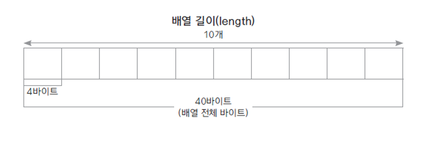
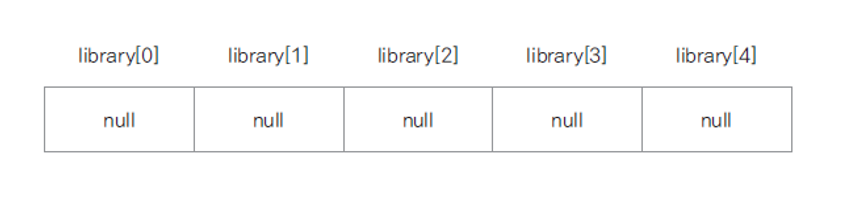
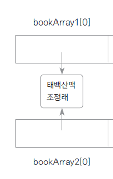
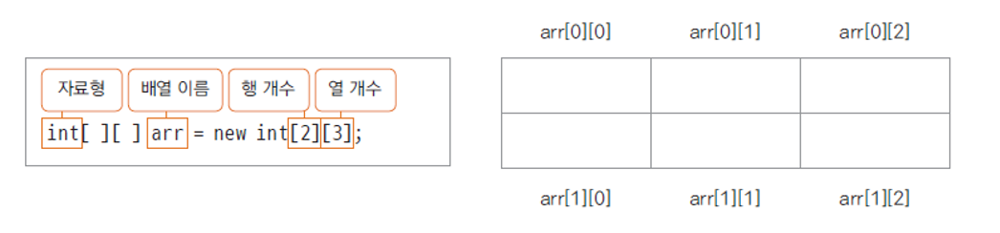

### 배열

동일한 자료형의 순차적인 자료구조

##### 기본 자료형 배열

- 배열 선언 방법

  `int[] arr = new int[10];`

  `int arr[] = new int[10];`

- 메모리 구조



##### 참조 자료형 배열 (객체 배열)

​	`Book[] library = new Book[5]`



배열 안에는 실제로 객체를 담는 것이 아니라 나중에 생성할 객체의 주소를 담는다. 


### 객체 배열 복사

##### 얕은 복사

실제로 인스턴스가 생겨서 복사되는 것이 아니라 주소만 복사됨

```java
public static void main(String[] args) {

		Book[] bookArray1 = new Book[5];
		Book[] bookArray2 = new Book[5];
		
		bookArray1[0] = new Book("태백산맥1", "조정래");
		bookArray1[1] = new Book("태백산맥2", "조정래");
		bookArray1[2] = new Book("태백산맥3", "조정래");
		bookArray1[3] = new Book("태백산맥4", "조정래");
		bookArray1[4] = new Book("태백산맥5", "조정래");
		
		System.arraycopy(bookArray1, 0, bookArray2, 0, 5);

		bookArray1[0].setTitle("나목");
		bookArray1[0].setAuthor("박완서");
		
		for( Book book : bookArray1) {
			book.showBookInfo();
		}
		
		System.out.println("===============");
		
		for( Book book : bookArray2) {
			book.showBookInfo();
		}
	}
```



##### 깊은 복사

```java
		copyLibrary[0] = new Book();
		copyLibrary[1] = new Book();
		copyLibrary[2] = new Book();
		copyLibrary[3] = new Book();
		copyLibrary[4] = new Book();
		
		for(int i = 0; i< library.length; i++) {
			copyLibrary[i].setTitle(bookArray1[i].getTitle());
			copyLibrary[i].setAuthor(bookArray1[i].getAuthor());
		}
		
		bookArray1[0].setTitle("나목");
		bookArray1[0].setAuthor("박완서");
		
		for( Book book : bookArray1) {
			book.showBookInfo();
		}
		
		System.out.println("===============");
		
		for( Book book : copyLibrary) {
			book.showBookInfo();
		}
```


### 다차원 배열

2차원 이상의 배열

지도, 게임, 평면이나 공간을 구현할 때 사용




```java
int[][] arr = { {1,2,3}, {4,5,6,7}};
		
for(int i =0; i<arr.length; i++) {
	for(int j=0; j<arr[i].length; j++) {
		System.out.print(arr[i][j] + " ");
}
System.out.println();

/* 출력결과
1 2 3
4 5 6
*/
```


### ArrayList

자바에서 제공되는 객체 배열이 구현된 클래스

객체 배열을 사용하는데 필요한 여러 메서드들이 구현되어 잇음.

```java
import java.util.ArrayList;

ArrayList<String> list = new ArrayList<String>;
list.add("abc");
list.add("def");
for (int i=0; i<list.size(); i++) {
    String str = list.get(i);
    system.out.println(str);
}
```


| 메서드              | 설명                                                       |
| ------------------- | ---------------------------------------------------------- |
| boolean add(E e)    | 요소 하나를 배열에추가 (E는 요소의 자료형)                 |
| int size()          | 배열에 추가된 요소 전체 개수를 반환                        |
| E get(int index)    | 배열의 index에 위치에 있는 요소 값 반환                    |
| E remove(int index) | 배열의 index에 위치에 있는 요소 값을 제거하고 그 값을 반환 |
| boolean isEmpyty()  | 배열이 비어 있는지 확인                                    |

 