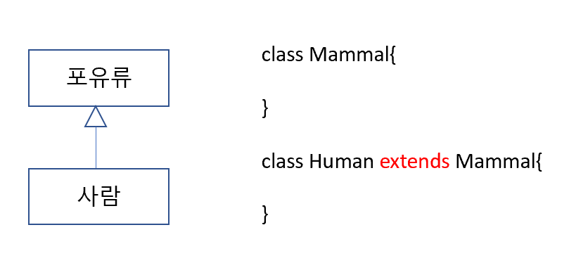

### 상속과 다형성

-------

#### 상속(Inheritance)

새로운 클래스를 정의 할 때 이미 구현된 클래스를 상속받아서 속성이나 기능이 확장되는 클래스를 구현함

(유사한 클래스를 만드는데 기존의 클래스를 사용해서 확장할 때 사용)

상위 클래스는 하위 클래스 보다 일반적인 개념과 기능을 가짐

하위 클래스는 상위 클래스 보다 구체적인 개념과 기능을 가짐



##### protected 예약어

외부 클래스에는 private로, 하위 클래스에서 public의 기능을 구현한 키워드

상위 클래스에 protected로 선언된 변수나 메서드는 다른 외부 클래스에서는 사용할 수 없지만 하위 클래스에서는 사용가능

|               | 외부 클래스 | 하위 클래스 | 동일 패키지 | 내부 클래스 |
| ------------- | ----------- | ----------- | ----------- | ----------- |
| public        | O           | O           | O           | O           |
| protected     | X           | O           | O           | O           |
| 선언되지 않음 | X           | X           | O           | O           |
| private       | X           | X           | X           | O           |

#### 하위 클래스 생성되는 과정

- 하위 클래스가 생성 될 때 상위 클래스가 먼저 생성 됨
- 하위 클래스의 생성자에서는 무조건 상위 클래스의 생성자가 호출되어야함
- 하위 클래스에서 상위 클래스의 생성자를 호출하는 코드가 없는 경우 컴파일러는 상위 클래스 기본 생성자를 호출하기 위한 `super()`를 추가함
- `super()` 로 호출되는 생성자는 상위 클래스의 기본 생성자
- 만약 상위 클래스의 기본 생성자가 없는 경우(매개변수가 있는 생성자만 존재하는경우) 하위 클래스는 명시적으로 상위 클래스의 생성자를 호출해야 함.


예제) Customer를 상속받아 구현하는 VIPCustomer 클래스

Customer

- customerID
- customerName
- customerGrade
- bonusPoint
- bonusRatio

VIPCustomer

​	(+) agentID

​	(+) salesRatio


#### 상위 클래스로의 묵시적 형 변환(업 캐스팅)

상위 클래스 형으로 변수를 선언하고 하위 클래스 인스턴스를 생성할 수 있음

상속관계에서 모든 하위 클래스는 상위클래스로 묵시적 형 변환이 됨. 그 역은 성립하지 않음.

```java
/*(선언된 클래스형)   (생성된 인스턴스의 클래스형)*/
Customer vc = new VIPCustomer();
```

VIPCustomer()의 생성자의 호출로 인스턴스는 모두 생성 되었지만,

타입이 Customer 이므로 접근 할 수 있는 변수나 메서드는 Customer의 변수와 메서드뿐이다.


#### 하위 클래스에서 메서드 재정의 하기

##### 오버라이딩 (overriding)

상위 클래스에서 정의된 메서드의 구현 내용이 하위 클래스에서 구현할 내용과 맞지 않는 경우 항위 클래스에서 동일한 이름의 메서드를 재정의 할 수 있음 

##### `@override` 애노테이션(Annotation)

재정의된 메서드라는 의미로 선언부가 기존의 메서드와 다른 경우 에러 발생

애노테이션은 컴파일러에게 특정한 정보를 제공해주는 역할을 함

| 애노테이션             | 설명                                                         |
| ---------------------- | ------------------------------------------------------------ |
| `@override`            | 재정의된 메서드라는 정보 제공                                |
| `@FunctionalInterface` | 함수형 인터페이스라는 정보 제공                              |
| `@Deprecated`          | 이후 버전에서 사용되지 않을 수 있는 변수,메서드에 사용됨     |
| `@SuppressWarnings`    | 특정 경고가 나타나지 않도록 함<br>예) `@SuppressWarnings("deprecation")`는 `@Deprecated`가 나타나지 않도록 함 |


##### 가상 메서드 (virtual method)

타입에 기반되서 생성되지 않고 생성된 인스턴스 기반에서 호출된다.

선언한 클래스형이 아닌 생성된 인스턴스의 메서드를 호출하는 것.


자바의 클래스는 멤버변수와 멤버함수로 이루어진다.

멤버변수와 멤버함수가 사용하는 메모리는 다르다.

클래스를 생성해서 인스턴스가 만들어지면 멤버 변수는 힙 메모리에 위치한다.

변수는 인스턴스가 생성될 때마다 새로 생성되지만, 메서드는 실행해야 할 명령 집합이기 때문에 인스턴스가 달라도 같은 메서드를 호출한다.


### 다형성 (Ploymorphism)

하나의 코드가 여러 자료형으로 구현되어 실행되는 것 (같은 코드에서 여러 실행 결과가 나옴)

정보은닉, 상속과 더불어 객체지향 프로그래밍의 가장 큰 특징 중 하나로 객체지향 프로그래밍의 유연성, 재활용성, 유지보수성에 기본이 되는 특징을 가진다.

예시)

```java
class Animal{
	public void move() {
		System.out.println("동물이 움직입니다.");
	}
}

class Human extends Animal{
	public void move() {
		System.out.println("사람이 두발로 걷습니다.");
	}
}

class Tiger extends Animal{
	public void move() {
		System.out.println("호랑이가 네 발로 뜁니다.");
	}
}

class Eagle extends Animal{
	public void move() {
		System.out.println("독수리가 하늘을 날아갑니다.");
	}
}

public class AnimalTest {
	public static void main(String[] args) {

		Animal hAnimal = new Human(); // 사람이 두발로 걷습니다.
		Animal tAnimal = new Tiger(); // 호랑이가 네 발로 뜁니다.
		Animal eAnimal = new Eagle(); // 독수리가 하늘을 날아갑니다.

		test.moveAnimal(hAnimal);
		test.moveAnimal(tAnimal);
		test.moveAnimal(eAnimal);
	}
    public void moveAnimal(Animal animal) {
        animal.move();
    }
```

유사한 클래스가 추가되는 경우 유지보수에 용이하고, 각 자료형마다 다른 메서드를 호출하지 않으므로 코드에서 많은 if문이 사라지는 것이 가능하다.


#### 하위 클래스로 형 변환, 다운캐스팅

묵시적으로 상위 클래스 형변환된 인스턴스가 원래 자료형(하위 클래스)으로 변환되어야 할 때 다운캐스팅이라고 한다.

하위 클래스로의 형 변환은 명시적으로 해줘야 한다.

`Customer vc = new VIPCustomer();` //  묵시적

`VIPCustomer vCustomer = (VIPCustomer)vc;` // 명시적


###### Instanceof로 인스턴스의 형 체크

```java
if ( hAnimal instanceof Human) { //hAnimal 인스턴스 자료형이 Human형 이라면
	Human human = (Human)hAnimal; //hAnimal을 Human형으로 다운 캐스팅해라
}
```

