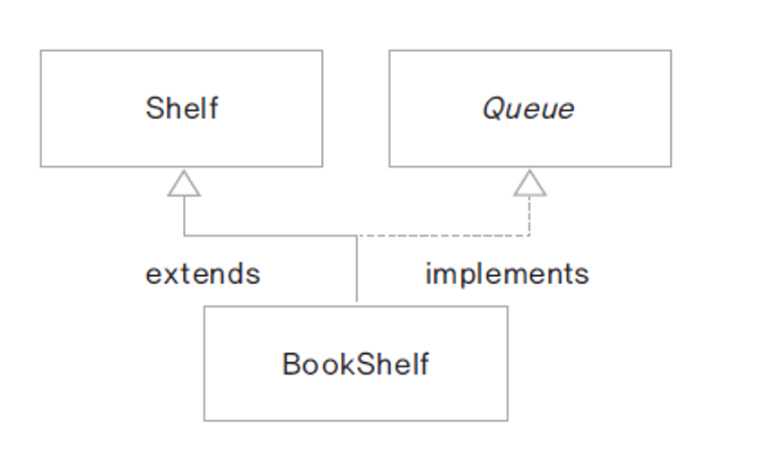

### 추상 클래스

- 추상 메서드(구현 코드가 없이 선언부만 있는 메서드)를 포함한 클래스
- abstract 예약어 사용
- 추상 클래스는 new (인스턴스화) 불가능

```java
public abstract class Computer {
    public abstract void display();
    public abstract void typing();
}
// 모든 메서드가 구현되었다고 해도 클래스에 abstract 키워드를 사용하면 추상 메서드
```

- 추상 클래스는 주로 상속의 상위클래스로 사용됨
- 추상 메서드 : 하위 클래스가 구현해야 하는 메서드(하위 클래스에 따라 재정의 가능)


#### 템플릿 메서드

추상 메서드나 구현된 메서드를 활용하여 전체의 흐름을 정의 해 놓은 메서드

final로 선언하여 재정의 할 수 없게 함

##### 템플릿 메서드 패턴

- 디자인 패턴의 일종
- 프레임 워크에서 많이 사용되는 설계 패턴
- 추상 클래스로 선언된 상위 클래스에서 추상 메서드를 이용하여 전체 구현의 흐름(시나리오)을 정의하고 구체적인 각 메서드 구현은 하위 클래스에 위임함

```java
public abstract class Car {
    public abstract void drive();
    public abstract void stop();
    
    public void startCar() {
        System.out.println("시동을 켭니다")
    }
    
    public void turnOff() {
        System.out.println("시동을 끕니다")
    }
    
    // 템플릿 메서드
    final public void run() { // 구현의 흐름(시나리오) 정의
        startCar();
        dirve();
        stop();
        turnOff();
    }
}
```

#### final

`final` 변수는 값이 변경될 수 없는 상수

`public static final double PI = 3.14;` // 오직 한번만 값을 할당 할 수 있음

final 메서드는 하위 클래스에서 재정의(overriding) 할 수 없음

final 클래스는 더 이상 상속되지 않음


#### 템플릿 메서드 활용 예제

player가 있고 레벨에 따라 run(), jump(), turn() 기능이 가능하다.

- 초보자 레벨: 천천히 달린다.(run() 가능)
- 중급자 레벨 : 빠르게 달리고 (run() 가능), 점프 (jump() 가능) 
- 고급자 레벨 : 엄청 빠르게 달리고(run() 가능), 점프(jump() 가능) 하고 
               한 바퀴 돌 수 있습니다.(turn() 가능)

*객체지향으로 만들지 않으면 복잡한 if문으로 만들어야 하고, 새로 추가 되었을 때 복잡해진다.*

###### PlayerLevel 클래스

```java
public abstract class PlayerLevel {
	
	public abstract void run();
	public abstract void jump();
	public abstract void turn();
	public abstract void showLevelMessage();
	
	
	final public void go(int count) {
		run();
		for(int i = 0; i<count; i++) {
			jump();
		}
		turn();
	}

}
```

###### Beginner, Advanced, Super 클래스

```java
public class BeginnerLevel extends PlayerLevel{

	public void run() {
		System.out.println("천천히 달립니다.");
	}
	public void jump() {
		System.out.println("jump 못하지롱");
	}
	public void turn() {
		System.out.println("turn 못하지롱");
	}
	public void showLevelMessage() {
		System.out.println("****** 초급자 레벨입니다. ******");
	}
}
```

###### Player 클래스

```java
public class Player {
	
	private PlayerLevel level;
	
	public Player(){
		level = new BeginnerLevel();
		level.showLevelMessage();
	}
	
	public PlayerLevel getLevel() {
		return level;
	}
	
	public void upgradeLevel( PlayerLevel level ) {
		this.level = level;
		level.showLevelMessage();
	}
	
	public void play(int count) {
		level.go(count);
	}
}
```

###### play test -main

```java
public class MainBoardPlay {

	public static void main(String[] args) {

		Player player = new Player();
		player.play(1);
		
		AdvancedLevel aLevel = new AdvancedLevel();
		player.upgradeLevel(aLevel);
		player.play(2);
		
		SuperLevel sLevel = new SuperLevel();
		player.upgradeLevel(sLevel);
		player.play(3);
	}
}
```

=> 레벨을 추가할때도 if문 하나없이 클래스 추가하면 편리하다.

​	시간절약, 필드와 메서드 이름을 통일해서 유지보수성을 높이고 통일성 유지 가능


#### 인터페이스

객체를 어떻게 구성해야 할지 정리할 설계도와 같은 개념.

인터페이스는 클라이언트 프로그램에 어떤 메서드를 제공하는지 알려주는 명세 또는 약속

한 객체가 어떤 인터페이스의 타입이라고 함은 그 인터페이스의 메서드를 구현했다는 의미

클라이언트 프로그램은 실제 구현내용을 몰라도 인터페이스의 정의만 알면 그 객체를 사용할 수 있음.


##### 구현방법

`interface` 키워드를 통해 선언하며 `implements`키워드를 통해 일반 클래스에서 인터페이스를 구현할 수 있음.


##### 인터페이스의 요소

- 상수 : 선언된 모든 변수는 상수로 처리 됨 (public static final)

- 메서드: 모든 메서드는 추상 메서드 (public abstract)

- 디폴트 메서드 : 기본 구현을 가지는 메서드(구현하는 클래스에서 재정의 가능)

- 정적 메서드 : 인스턴스 생성과 상관없이 인터페이스 타입으로 호출하는 메서드

- private 메서드 : 인터페이스 내에서 사용하기 위해 구현한 메서드

  ​							(구현하는 클래스에서 재정의 불가능) - java 9


인터페이스를 활용하면 다양한 정책이나 알고리즘을 프로그램의 큰 수정 없이 적용 및 확장이 가능하다.


##### 인터페이스 상속

인터페이스 간에도 상속이 가능함.

구현이 없으므로 extends 뒤에 여러 인터페이스를 상속받을 수 있음

구현 내용이 없어서 타입 상속(type inheritance) 라고 함


#### 인터페이스 구현과 클래스 상속 함께 사용하기 예시



```java
import java.util.ArrayList;

public class Shelf {
	 protected ArrayList<String> shelf; // 하위 클래스에서 사용할 수 있도록 protected
	 
	 public Shelf() {
		 shelf = new ArrayList<String>();
	 }
	 
	 public ArrayList<String> getShelf(){
		 return shelf;
	 }
	 
	 public int getCount() {
		 return shelf.size();
	 } 
}
```

```java
public interface Queue {
	void enQueue(String title);
	String deQueue();
	
	int getSize();
}
```

```java
public class BookShelf extends Shelf implements Queue{
    @Override
    public void enQueue(String title) { // 배열에 요소 추가
        shelf.add(title);
    }
    
    @Override
    public String deQueue(){ // 맨 처음 요소를 삭제하고 반환
        return shelf.remove(0);
    }
    
    @Override
    public int getSize() { // 배열 요소 개수 반환
        return getCount();
    }
}
```

```java
public class BookShelfTest {
    
	public static void main(String[] args) {
		Queue bookQueue = new BookShelf();
		bookQueue.enQueue("태백산맥1");
		bookQueue.enQueue("태백산맥2");
		bookQueue.enQueue("태백산맥3");
		
		System.out.println(bookQueue.deQueue());
		System.out.println(bookQueue.deQueue());
		System.out.println(bookQueue.deQueue());
	}
}
```


##### 인터페이스를 왜 쓰는가?

- 완벽한 추상화를 달성하기 위해서
- 인터페이스를 사용함으로써, 다중상속의 기능을 지원받음
- 다형성


##### 인터페이스 방식으로 설계한다는 의미가 무엇인가?

프로그램을 설계하고 조금 더 유연한 프로그램을 만들 수 있음

서비스 개발의 life-cycle을 설계, 개발, 유지보수 세 단계로 나누면 유지보수가 가장 큰 부분을 차지하는데, 이때 유지보수나  + 서비스가 확장될 때 좀 더 변화에 유연하게 대응 할 수 있음

(실제로 프로젝트 하면서 기능을 추가하려고 할 때 이거 고치면 저거 안돌아가고 결국에는 처음부터 손 보는게 나을정도가 되었던 경험들이 있을 것 이다)

인터페이스 방식으로 설계하면 객체간의 결합이 느슨해져서 변경이나 확장이 용이하다.